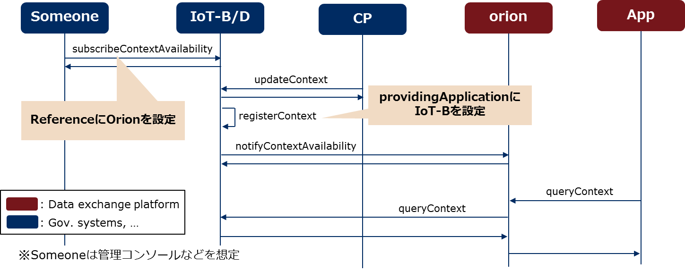
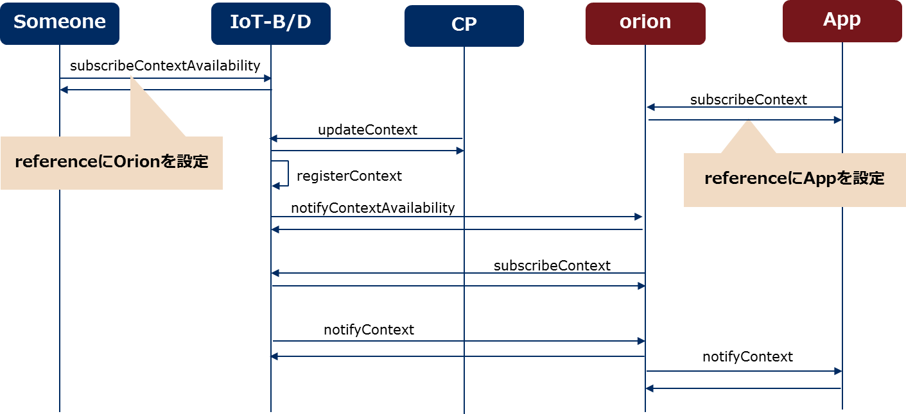

# Federation of IoT platforms

## Before to start

####Build the IoT Broker docker

Copy the docker file somewhere in the filesystem (lets assume in ~/AeronIoTBroker/):
```
wget https://github.com/Aeronbroker/Aeron/blob/master/docker/develop-standalone/dockerfile
```

Build the docker:
```
sudo docker build --no-cache=true -t fiware/iotbroker:standalone-dev .
```


####Build the Orion Context Broker docker

Create a file somewhere in the file system (lets assume in ~/Orion/) named “docker-compose.yml” (https://hub.docker.com/r/fiware/orion/) with the following content:

```
mongo:
   image: mongo:3.2
   command: --nojournal
 orion:
   image: fiware/orion
   links:
     - mongo
   ports:
     - "1026:1026"
   command: -dbhost mongo
```

####Get the NGSI emulator

The NGSI emulator is all contained in a Java library that needs to be compiled.

Downloading or cloning the full Aeron project gives you already all what you need. Otherwise the minimum set of code to be downloaded from the Aeron project (https://github.com/Aeronbroker/Aeron) is:
* IoTbrokerParent folder
* eu.neclab.iotplatform.ngsi.api folder
* eu.neclab.iotplatform.iotbroker.commons folder
* eu.neclab.iotplatform.ngsiemulator folder

If you have already compiled the Aeron IoT Broker you can skip the next step. Otherwise you need to make the following (in the command line):
```
cd IoTbrokerParent/
mvn clean install

cd eu.neclab.iotplatform.ngsi.api/
mvn clean install

cd eu.neclab.iotplatform.iotbroker.commons/
mvn clean install
```

Afterwards you can proceed to generate the executable jar file:
```
cd eu.neclab.iotplatform.ngsiemulator/
mvn clean install
```

This will produce the *ngsiemulator-{version}-jar-with-dependencies.jar* executable jar and placed into the *eu.neclab.iotplatform.ngsiemulator/target/* folder.

## Orion as Data Exchange Platform, IoT Broker as IoT Single Domain

### NGSI-9 Type Federation: Test Case 1 (queryContext + Context Producer)





####Setting up Orion Context Broker as Data Exchange Platform


Run the following commands:

```
cd ~/Orion/
sudo docker-compose up
```


####Setting up IoT Broker as IoT Single Domain platform


Run the following command:
```
sudo docker run -t \
-p 8060:8060 \
-p 8065:8065 \
--name=iotbroker \
fiware/iotbroker:standalone-dev \
-p iotbroker_historicalagent="enabled"
-p iotbroker_ngsi9remoteurl=”http://localhost:8065/ngsi9/”
```


#### SubscribeContextAvailabilityRequest to IoT Broker on behalf of Orion
Request:
```
POST http://localhost:8065//ngsi9/subscribeContextAvailability
Content-Type: application/json
Accept: application/json
{
	"reference": "http://172.17.0.1:1026/ngsi9/notifyContextAvailability",
    	"entities": [{
        "id": ".*",
        "isPattern": true
    	}]
}
```
NOTE:  172.17.0.1 is the IP address of the docker daemon which is the gateway address for all the docker images. It might change from machine to machine and it can be configurable (see docker documentation).
Response:
```
{
    "duration": null,
    "errorCode": null,
    "subscribeId": "40925-04c2b-0A3C4-e1b17-40c0a-10949be15b6668ee1a1_-_1-e4ae48cf8371d825e25455c379b8a4d1"
}
```

#### UpdateContextRequest to IoT Broker (single domain platform)

Request to IoT Broker:

```
POST http://localhost:8060/ngsi10/updateContext
Content-Type: application/json
Accept: application/json

{
    "contextElements": [{
        "attributes": [{
            "contextValue": "13.48",
            "metadata": [{
                "name": "creation_time",
                "value": "2016.12.14 18:38:08:836 +0100",
                "type": "string"
            }, {
                "name": "Unit",
                "value": "m3-lite:DegreeCelsius",
                "type": "string"
            }],
            "name": "m3-lite:AirTemperature",
            "type": "string"
        }],
        "domainMetadata": [{
            "name": "SimpleGeolocation",
            "value": {
                "latitude": 43.46263,
                "longitude": -3.7988
            },
            "type": "point"
        }, {
            "name": "AbstractionLevel",
            "value": "0",
            "type": "string"
        }],
        "entityId": {
            "isPattern": false,
            "id": "sensor-2"
        }
    }],
    "updateAction": "APPEND"
}

```

Response:

```
{
    "errorCode": {
        "code": 200,
        "reasonPhrase": "OK",
        "details": ""
    },
    "contextResponses": null
}
```
#### QueryContext to Orion (data exchange platform)

Request:
```
POST http://localhost:1026/v1/queryContext
Content-Type: application/json
Accept: application/json

{
    "entities": [
        {
            "isPattern": "true",
            "id": ".*"
        }
    ]
}
```

Response:
```
{
    "contextResponses": [
        {
            "contextElement": {
                "type": "null",
                "isPattern": "false",
                "id": "sensor-2",
                "attributes": [
                    {
                        "name": "m3-lite:AirTemperature",
                        "type": "string",
                        "value": "13.48",
                        "metadatas": [
                            {
                                "name": "creation_time",
                                "type": "string",
                                "value": "2016.12.14 18:39:08:836 +0100"
                            },
                            {
                                "name": "Unit",
                                "type": "string",
                                "value": "m3-lite:DegreeCelsius"
                            }
                        ]
                    },
                    {
                        "name": "position",
                        "type": "geo:point",
                        "value": "43.46263, -3.7988"
                    }
                ]
            },
            "statusCode": {
                "code": "200",
                "reasonPhrase": "OK"
            }
        }
    ]
}
```


### NGSI-9 Type Federation: Test Case 2 (queryContext + Context Provider)


####Setting up Orion Context Broker as Data Exchange Platform

Run the following commands:

```
cd ~/Orion/
sudo docker-compose up
```


####Setting up IoT Broker as IoT Single Domain platform


Run the following command:
```
sudo docker run -t \
-p 8060:8060 \
-p 8065:8065 \
--name=iotbroker \
fiware/iotbroker:standalone-dev
```

#### SubscribeContextAvailabilityRequest to IoT Broker on behalf of Orion

Request:
```
POST http://localhost:8065//ngsi9/subscribeContextAvailability
Content-Type: application/json
Accept: application/json
{
	"reference": "http://172.17.0.1:1026/ngsi9/notifyContextAvailability",
    	"entities": [{
        "id": ".*",
        "isPattern": true
    	}]
}
```
NOTE:  172.17.0.1 is the IP address of the docker daemon which is the gateway address for all the docker images. It might change from machine to machine and it can be configurable (see docker documentation).
Response:
```
{
    "duration": null,
    "errorCode": null,
    "subscribeId": "40925-04c2b-0A3C4-e1b17-40c0a-10949be15b6668ee1a1_-_1-e4ae48cf8371d825e25455c379b8a4d1"
}
```

####Setting up an emulated ContextProvider with NGSI Emulator and and let it perform automatically a Registration

We are going to start the NGSI Emulator for creating a ContextProvider which at the startup performs automatically a registration. We instruct the Context Provider to handles only one EnytityId and one Attribute in random mode (see https://github.com/Aeronbroker/Aeron/tree/master/eu.neclab.iotplatform.ngsiemulator).

Run the following command:
```
java -cp ngsiemulator-$VERSION-jar-with-dependencies.jar \
-Deu.neclab.ioplatform.ngsiemulator.iotprovider.ports=8101 \
-Deu.neclab.ioplatform.ngsiemulator.iotprovider.doRegistration=true \
-Deu.neclab.ioplatform.ngsiemulator.iotDiscoveryUrl="http://localhost:8065/" \
-Deu.neclab.ioplatform.ngsiemulator.iotprovider.mode="Random" \
-Deu.neclab.ioplatform.ngsiemulator.iotprovider.rangesOfEntityIds="1" \
-Deu.neclab.ioplatform.ngsiemulator.iotprovider.numberOfEntityIdsToSelect="1" \
-Deu.neclab.ioplatform.ngsiemulator.iotprovider.rangesOfAttributes="1" \
-Deu.neclab.ioplatform.ngsiemulator.iotprovider.numberOfAttributesToSelect="1" \
eu.neclab.iotplatform.ngsiemulator.server.MainIoTProvider
```
NOTE: remember to set the VERSION variable

Looking at the log, the emulated NGSI provider has made a registration similar to the following (XML is set by default):

```
<?xml version="1.0" encoding="UTF-8"?><registerContextRequest>
  <contextRegistrationList>
    <contextRegistration>
      <entityIdList>
        <entityId isPattern="false">
          <id>EntityId-1</id>
        </entityId>
      </entityIdList>
      <contextRegistrationAttributeList>
        <contextRegistrationAttribute>
          <name>Attribute-1</name>
          <isDomain>false</isDomain>
        </contextRegistrationAttribute>
      </contextRegistrationAttributeList>
      <providingApplication>http://localhost:8101/ngsi10/</providingApplication>
    </contextRegistration>
  </contextRegistrationList>
</registerContextRequest>

```

#### QueryContext to Orion (data exchange platform)

Request:
```
POST http://localhost:1026/v1/queryContext
Content-Type: application/json
Accept: application/json

{
    "entities": [{
        "id": "EntityId-1",
        "isPattern": true
    }]
}
```

Response:
```
{
    "errorCode": null,
    "contextResponses": [
        {
            "contextElement": {
                "id": "EntityId-1",
                "type": null,
                "isPattern": false,
                "attributes": [
                    {
                        "name": "Attribute-1",
                        "type": null,
                        "value": "495083856",
                        "metadatas": []
                    }
                ]
            },
            "statusCode": {
                "code": "200",
                "reasonPhrase": "OK"
            }
        }
    ]
}
```

### NGSI-9 Type Federation: Test Case 2 (queryContext + Context Provider)




####Setting up Orion Context Broker as Data Exchange Platform

Run the following commands:

```
cd ~/Orion/
sudo docker-compose up
```


####Setting up IoT Broker as IoT Single Domain platform


Run the following command:
```
sudo docker run -t \
-p 8060:8060 \
-p 8065:8065 \
--name=iotbroker \
fiware/iotbroker:standalone-dev \
-p iotbroker_historicalagent="enabled" \
-p iotbroker_ngsi9remoteurl=”http://localhost:8065/ngsi9/”
```

####Setting up an emulated IoT Application with NGSI Emulator

We are going to start the NGSI Emulator for creating an IoT Application (see https://github.com/Aeronbroker/Aeron/tree/master/eu.neclab.iotplatform.ngsiemulator#iot-application).

Run the following command:
```
java -cp ngsiemulator-$VERSION-jar-with-dependencies.jar \
-Deu.neclab.ioplatform.ngsiemulator.iotapplication.ports=8201 \
eu.neclab.iotplatform.ngsiemulator.server.MainIoTApplication
```
NOTE: remember to set the VERSION variable

#### SubscribeContextAvailabilityRequest to IoT Broker on behalf of Orion
Request:
```
POST http://localhost:8065//ngsi9/subscribeContextAvailability
Content-Type: application/json
Accept: application/json
{
    "reference": "http://172.17.0.1:1026/ngsi9/notifyContextAvailability",
    "entities": [{
        "id": ".*",
        "isPattern": true
    }]
}
```
NOTE:  172.17.0.1 is the IP address of the docker daemon which is the gateway address for all the docker images. It might change from machine to machine and it can be configurable (see docker documentation).
Response:
```
{
    "duration": null,
    "errorCode": null,
    "subscribeId": "40925-04c2b-0A3C4-e1b17-40c0a-10949be15b6668ee1a1_-_1-e4ae48cf8371d825e25455c379b8a4d1"
}
```

#### SubscribeContextRequest (subscription for data) to Orion on behalf of the App

Request:
```
POST http://localhost:1026/v1/subscribeContext
Content-Type: application/json
Accept: application/json
{
    "reference": "http://localhost:8201/ngsi10/notify",
    "entities": [{
        "id": ".*",
        "isPattern": true
    }]
}
```

Response:

```
{
    "subscribeResponse": {
        "subscriptionId": "59aea76f2bf48d00696ca57e",
        "duration": "PT24H"
    }
}
```

#### UpdateContextRequest to IoT Broker (single domain platform)

Request to IoT Broker:

```
POST http://localhost:8060/ngsi10/updateContext
Content-Type: application/json
Accept: application/json

{
    "contextElements": [{
        "attributes": [{
            "contextValue": "13.48",
            "metadata": [{
                "name": "creation_time",
                "value": "2016.12.14 18:38:08:836 +0100",
                "type": "string"
            }, {
                "name": "Unit",
                "value": "m3-lite:DegreeCelsius",
                "type": "string"
            }],
            "name": "m3-lite:AirTemperature",
            "type": "string"
        }],
        "domainMetadata": [{
            "name": "SimpleGeolocation",
            "value": {
                "latitude": 43.46263,
                "longitude": -3.7988
            },
            "type": "point"
        }, {
            "name": "AbstractionLevel",
            "value": "0",
            "type": "string"
        }],
        "entityId": {
            "isPattern": false,
            "id": "sensor-2"
        }
    }],
    "updateAction": "APPEND"
}

```

Response:

```
{
    "errorCode": {
        "code": 200,
        "reasonPhrase": "OK",
        "details": ""
    },
    "contextResponses": null
}
```

And after some internal messaging among the IoT Broker and Orion, the emulated IoT Application is receiving the following notification:

```
{
    "contextResponses": [{
        "contextElement": {
            "attributes": [{
                "metadata": [{
                    "name": "creation_time",
                    "value": "2016.12.14 18:39:08:836 +0100",
                    "type": "string"
                }, {
                    "name": "Unit",
                    "value": "m3-lite:DegreeCelsius",
                    "type": "string"
                }],
                "contextValue": "13.48",
                "name": "m3-lite:AirTemperature",
                "type": "string"
            }],
            "entityId": {
                "isPattern": false,
                "id": "sensor-2"
            },
            "domainMetadata": [{
                "name": "SimpleGeolocation",
                "value": {
                    "latitude": 43.46263,
                    "longitude": -3.7988
                },
                "type": "point"
            }, {
                "name": "AbstractionLevel",
                "value": "0",
                "type": "string"
            }]
        },
        "statusCode": {
            "code": 200,
            "details": "New ContextElement",
            "reasonPhrase": "OK"
        }
    }],
    "subscriptionId": "70e28-b4c2f-dD583-aBcF3-45873-c595a4705c35731a067"
}
```

### NGSI-9 Type Federation: Test Case 2 (queryContext + Context Provider)


####Setting up Orion Context Broker as Data Exchange Platform

Run the following commands:

```
cd ~/Orion/
sudo docker-compose up
```


####Setting up IoT Broker as IoT Single Domain platform


Run the following command:
```
sudo docker run -t \
-p 8060:8060 \
-p 8065:8065 \
--name=iotbroker \
fiware/iotbroker:standalone-dev
```

####Setting up an emulated IoT Application with NGSI Emulator

We are going to start the NGSI Emulator for creating an IoT Application (see https://github.com/Aeronbroker/Aeron/tree/master/eu.neclab.iotplatform.ngsiemulator#iot-application).

Run the following command:
```
java -cp ngsiemulator-$VERSION-jar-with-dependencies.jar \
-Deu.neclab.ioplatform.ngsiemulator.iotapplication.ports=8201 \
eu.neclab.iotplatform.ngsiemulator.server.MainIoTApplication
```
NOTE: remember to set the VERSION variable

#### SubscribeContextAvailabilityRequest to IoT Broker on behalf of Orion
Request:
```
POST http://localhost:8065//ngsi9/subscribeContextAvailability
Content-Type: application/json
Accept: application/json
{
    "reference": "http://172.17.0.1:1026/ngsi9/notifyContextAvailability",
    "entities": [{
        "id": ".*",
        "isPattern": true
    }]
}
```
NOTE:  172.17.0.1 is the IP address of the docker daemon which is the gateway address for all the docker images. It might change from machine to machine and it can be configurable (see docker documentation).
Response:
```
{
    "duration": null,
    "errorCode": null,
    "subscribeId": "40925-04c2b-0A3C4-e1b17-40c0a-10949be15b6668ee1a1_-_1-e4ae48cf8371d825e25455c379b8a4d1"
}
```


####Setting up an emulated ContextProvider with NGSI Emulator and let it perform automatically a Registration

We are going to start the NGSI Emulator for creating a ContextProvider which at the startup performs automatically a registration. We instruct the Context Provider to handles only one EnytityId and one Attribute in random mode (see https://github.com/Aeronbroker/Aeron/tree/master/eu.neclab.iotplatform.ngsiemulator).

Run the following command:
```
java -cp ngsiemulator-$VERSION-jar-with-dependencies.jar \
-Deu.neclab.ioplatform.ngsiemulator.iotprovider.ports=8101 \
-Deu.neclab.ioplatform.ngsiemulator.iotprovider.doRegistration=true \
-Deu.neclab.ioplatform.ngsiemulator.iotDiscoveryUrl="http://localhost:8065/" \
-Deu.neclab.ioplatform.ngsiemulator.iotprovider.mode="Random" \
-Deu.neclab.ioplatform.ngsiemulator.iotprovider.rangesOfEntityIds="1" \
-Deu.neclab.ioplatform.ngsiemulator.iotprovider.numberOfEntityIdsToSelect="1" \
-Deu.neclab.ioplatform.ngsiemulator.iotprovider.rangesOfAttributes="1" \
-Deu.neclab.ioplatform.ngsiemulator.iotprovider.numberOfAttributesToSelect="1" \
eu.neclab.iotplatform.ngsiemulator.server.MainIoTProvider
```
NOTE: remember to set the VERSION variable

Looking at the log, the emulated NGSI provider has made a registration similar to the following (XML is set by default):

```
<?xml version="1.0" encoding="UTF-8"?><registerContextRequest>
  <contextRegistrationList>
    <contextRegistration>
      <entityIdList>
        <entityId isPattern="false">
          <id>EntityId-1</id>
        </entityId>
      </entityIdList>
      <contextRegistrationAttributeList>
        <contextRegistrationAttribute>
          <name>Attribute-1</name>
          <isDomain>false</isDomain>
        </contextRegistrationAttribute>
      </contextRegistrationAttributeList>
      <providingApplication>http://localhost:8101/ngsi10/</providingApplication>
    </contextRegistration>
  </contextRegistrationList>
</registerContextRequest>

```

#### SubscribeContextRequest (subscription for data) to Orion on behalf of the App

Request:
```
POST http://localhost:1026/v1/subscribeContext
Content-Type: application/json
Accept: application/json
{
    "reference": "http://localhost:8201/ngsi10/notify",
    "entities": [{
        "id": ".*",
        "isPattern": true
    }]
}
```

Response:

```
{
    "subscribeResponse": {
        "subscriptionId": "59aea76f2bf48d00696ca57e",
        "duration": "PT24H"
    }
}
```
